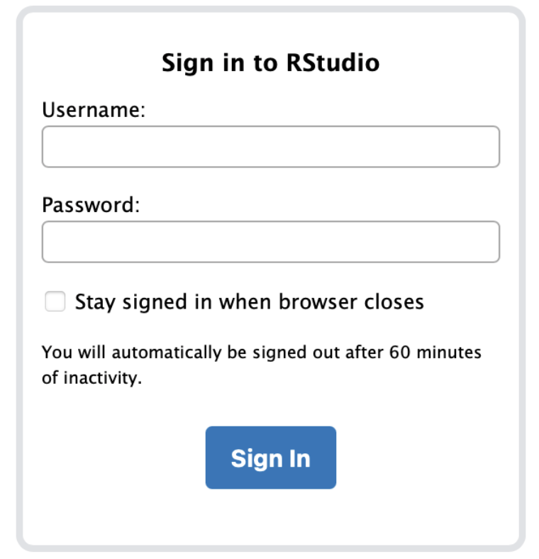
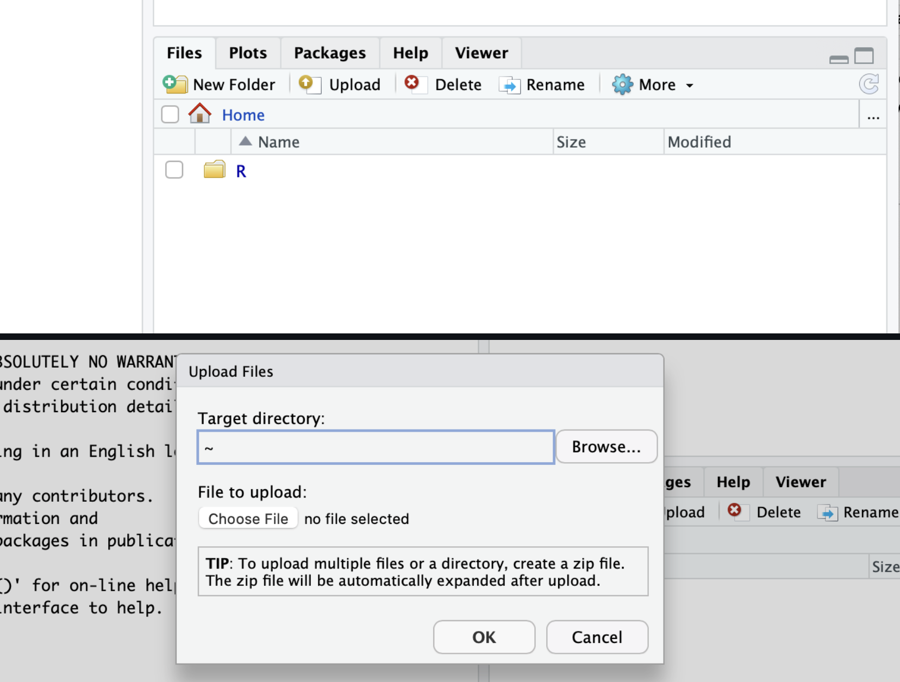

## Overview

::: callout-note
## Biological question

What information can we recover from an unfamiliar sequence file?
:::

This first session has two jobs. It gives everyone a shared mental model of **how a
computer works** and **what a compute cluster is**, and it runs a short **diagnostic**
so the rest of the course can be adjusted to the group. No prior experience is assumed.
If you have used a terminal before, help the person next to you.

::: callout-tip
## Starting-point survey (about 4 min)

Before the lecture, fill in the short survey: [starting-point survey](https://forms.gle/au3JoYFokMEEzbqx7),
or scan the code below.

{width="140"}

It asks about your background, the tools you have already met, and the data you care
about. Your name is **optional** and the survey is **not graded**: the answers are used
to weight the examples for the rest of the course, and the class summary is shown back
to you a few minutes later so you can see how mixed the starting levels are.

This is separate from Section 1 of your worksheet, a self-assessment you fill in at the
end of the practical (block G). Nothing in Sessions 1 and 2 is graded.
:::

### Learning outcomes

By the end of this session, you should be able to:

- name a few common types of biological data and say roughly how each is produced;
- name the main parts of a computer and say what each one does;
- explain what a compute cluster is and why we use one;
- connect to the university cluster through RStudio Server (and know that `ssh` exists);
- distinguish the RStudio **Console** from the **Terminal**;
- identify your current folder and list its contents;
- create and enter a folder;
- copy a file and look inside it with `head`, `tail`, `grep`, and `wc`;
- recognise **FASTA** records, count them reliably, and spot one that is not DNA or was truncated;
- read an error message and correct the command;
- keep a command log that another person can rerun from a clean start.

### Session plan

| Time | Block | What happens |
|---:|---|---|
| 14:15-14:20 | Welcome | Anonymous starting-point survey (Form). |
| 14:20-14:32 | Theory 1 | What bioinformatics is, and where biological data comes from. |
| 14:32-14:45 | Theory 2 | How a computer works (live teardown). |
| 14:45-15:00 | Theory 3-4 | From your laptop to a cluster. The FASTA format. Practical briefing. |
| 15:00-15:15 | Practical A | Connect to RStudio Server. Console vs Terminal. Start a command log. |
| 15:15-15:35 | Practical B | Navigate folders: predict each line, then run it. |
| 15:35-15:50 | Practical C | Copy the file. Four ways to look inside it. |
| 15:50-16:00 | Checkpoint | Save your work. Short break. |
| 16:00-16:22 | Practical D | The investigation: what is wrong with `mystery.fasta`? (pairs) |
| 16:22-16:40 | Practical E | Break it and diagnose: six failures, six causes. (pairs) |
| 16:40-16:50 | Practical F | Reproduce a partner's script from an empty folder. |
| 16:50-17:00 | Practical G | Individual wrap-up (not graded). |

## Theory (≈45 min)

### 1. Bioinformatics and the data it works on

Bioinformatics connects a **biological question** to **data** and to a **reproducible
analysis** that produces a result you can explain.

```{mermaid}
flowchart LR
  Q["Biological question<br/>(e.g. which genes respond to stress in this organism?)"] --> D["Data<br/>(files: FASTA, FASTQ, tables…)"]
  D --> A["Analysis<br/>(a few commands, run in order)"]
  A --> R["Result<br/>(a number, a table, a figure)"]
  R --> I["Interpretation<br/>(answer + one limitation)"]
```

The analysis is just a **list of commands run in a defined order**. If you write the
commands down, another person (including future you) can run them again and get the
same result. That is what "reproducible" means, and it is the habit this course builds.

#### Where does biological data come from?

Different instruments answer different questions. You do not need to master any of these
today: the goal is to recognise the main families and the kind of file each one lands in.

| Data type | How it is produced | Typical files | Example question | In this course |
|---|---|---|---|---|
| Genome / amplicon sequencing | High-throughput sequencers (Illumina, Oxford Nanopore) read DNA fragments | FASTA, FASTQ | Which species are in this soil sample? | Sessions 2-3, 5-6 |
| Bulk RNA-seq | Sequencing of RNA pooled from many cells → one expression value per gene | FASTQ → count table (CSV/TSV) | Which genes respond to drought? | Session 8 (project) |
| Single-cell RNA-seq | RNA sequenced **per individual cell** | sparse matrix (MTX, H5) | Which cell types are present, and how do they differ? | mentioned only |
| Proteomics | Mass spectrometry of peptides | mzML → abundance table | Which proteins change with treatment? | mentioned only |
| Metabolomics | Mass spectrometry or NMR of small molecules | feature-intensity tables | Which metabolites mark a phenotype? | mentioned only |
| Imaging / microscopy | Automated microscopes + image segmentation | TIFF / OME-TIFF → measurement tables | Does cell shape change between conditions? | mentioned only |
| Genotyping / GWAS | SNP arrays or sequencing → genotype matrix | VCF, genotype tables | Which variants associate with a trait? | Session 6 / project |

**The pattern to remember:** whatever the instrument, the analysis almost always ends up
in one of two shapes of text file: **sequences** (FASTA, FASTQ) or **tables** (rows =
samples or features, columns = variables). This course spends its time teaching you to
open, check, and summarise those two shapes with confidence.

**Bulk vs single-cell, in one line each.** *Bulk* measures the average over thousands of
cells: cheap, and enough to ask "which genes differ between conditions". *Single-cell*
resolves cell-to-cell variation and rare populations: more expensive, and the data are
much sparser. How the sequencing itself works (library preparation, paired-end reads,
read length) comes in Session 2, alongside FASTQ and quality control.

### 2. How a computer works

A computer has a small number of parts. Each one has a single job.

| Part | Job | Kitchen analogy |
|---|---|---|
| **CPU** (processor) | Does the calculations, one step after another (very fast). | The cook |
| **RAM** (memory) | Holds the data currently being worked on. Fast, but **erased when the power goes off**. | The worktop: only what you are using right now fits on it |
| **Disk / SSD** (storage) | Keeps files when the power is off. Slower than RAM, much bigger. | The fridge and cupboards |
| **GPU** (graphics card) | Does many simple calculations in parallel. Used for images and for deep learning. | A brigade of line cooks all chopping at once |
| **Operating system** (Linux, macOS, Windows) | Manages the parts, the files, and the programs. | The kitchen manager |
| **Network card** | Talks to other computers. | The delivery door |

Two ideas matter for the rest of the course:

- **A program is just a file** that the CPU knows how to run. `ls`, `head`, `R` and
  `blast` are all programs sitting on the disk.
- **Files live in folders, folders live in folders.** The chain of folder names that
  leads to a file is its **path**, for example `/home/you/bioinfo_course/data/reads.fasta`.
  The leading `/` is the top of the tree. The folder you are "standing in" right now is
  the **working directory**; a command that is given no path looks there.

#### The shell

The **shell** lets you drive the computer by typing commands instead of clicking. You
type the name of a program, press <kbd>Enter</kbd>, and read what it prints back. If you
know R, this is the same idea with a different language. The shell we use is called
**bash**. It is good at three things bioinformatics needs constantly: navigating files,
repeating an analysis exactly, and moving or summarising large files automatically.

### 3. From your laptop to a compute cluster

A laptop is fine for writing code and looking at results. It is not fine for aligning a
million sequencing reads: not enough CPU, not enough memory, and the data would not even
fit. A **compute cluster** solves this. It is a set of powerful computers ("nodes") in a
server room that many people share, with the large data stored right next to them.

For this course we use **LEGcompute**, hosted by the Laboratory of Evolutionary Genetics
and shared across the Institute of Biology
([crolllab/IBIOL-compute-resources](https://github.com/crolllab/IBIOL-compute-resources)).

{width="380"}

| Resource | LEGcompute |
|---|---|
| CPU cores | ~1000 (Intel + AMD) |
| GPUs | RTX 3090, 3× RTX A5500, 4× RTX 5000 Ada, 2× RTX PRO 6000 (96 GB) |
| Memory | 4 TB RAM |
| Storage | 80 TB SSD |
| System | Ubuntu 26.04 LTS, Slurm scheduler, RStudio Server |

#### How the cluster is organised

```{mermaid}
flowchart LR
  L["Your laptop"] -- "https :8787 (RStudio)" --> H
  L -- "ssh" --> H
  H["Login / head node<br/>(where you land)"] -- "sbatch / srun" --> S["Slurm scheduler"]
  S --> C1["compute node"]
  S --> C2["compute node"]
  S --> G["GPU node"]
  H --- ST[("Shared storage<br/>/home  /data  /scratch")]
  C1 --- ST
  C2 --- ST
  G --- ST
```

- You **log in to the head node**. Everyone shares it, so it is for light interactive
  work only: editing, plotting, small commands (everything we do today).
- Real jobs are **submitted to Slurm** with `sbatch`, which sends them to a free compute
  node so the machine is never overloaded and everyone gets a fair share. We meet Slurm
  properly in a later session.
- **Storage is shared** by every node, so a file you create on the head node is visible
  in your jobs too:
  - `/home/username`: scripts and small files (**quota: 100 GB per student**);
  - `/data/username`: large datasets and analysis output (1+ TB);
  - `/scratch`: temporary space; **files older than 30 days are deleted automatically**.
- **~200 bioinformatics tools** are pre-installed as *modules* (`module load SAMtools`).
  Nothing to install during class.

::: callout-important
## No backups

No backup is made of anything on the server. Keeping a copy of work you care about is
your responsibility.
:::

#### Access for this course

::: callout-important
## Connecting to LEGcompute

**1. Be on the university network.** Either the `unine` WiFi on campus, or the
[GlobalProtect VPN](https://mydoc.unine.ch/fr/Internet_VPN_WiFi/VPN) from home. There is
no way in from the open internet.

**2. Claim your account.** [Open the shared Google Sheet the instructor](https://docs.google.com/spreadsheets/d/1QaN-ZJ-bWl8s_HbvMpZnnwgBn-5SQyBFRyZqk5vqST8/edit?usp=sharing).
On the course tab, pick a free username and write your name in the yellow cell next to
it. The first page of the sheet explains how to set or reset your password (via the
[user account server](https://legserv.de6.quickconnect.to)).

**3. Connect (pick one):**

| Method | How | Good for |
|---|---|---|
| **RStudio Server** | Browser → <http://legcompute.unine.ch:8787> → log in. Use the **Terminal** tab for the shell. | **Everyone today.** Nothing to install. |
| **SSH** | In a local terminal: `ssh username@legcompute.unine.ch` | Later, once you are comfortable. |

We use **RStudio Server** for the whole course. It gives you an editor, an R Console, a
Terminal and a file browser in one browser tab, with nothing to install.
:::

### 4. The FASTA format

**FASTA** is the simplest way to store one or more biological sequences as text. A
**record** has two parts:

1. a **header line**, whose first character is `>`, giving the sequence a name;
2. one or more **sequence lines** (the bases or amino acids).

```default
>NC_045512.2 Severe acute respiratory syndrome coronavirus 2, surface glycoprotein region (partial)
ATGTTTGTTTTTCTTGTTTTATTGCCACTAGTCTCTAGTCAGTGTGTTAATCTTACAACC
AGAACTCAATTACCCCCTGCATACACTAATTCTTTCACACGTGGTGTTTATTACCCTGAC
>oligo_F short PCR primer
GATTACAGGCGTGAGCCACCACGT
```

Here the first record's sequence is wrapped over two lines; the second fits on one. Both
are still single records.

The next record starts at the next line beginning with `>`. Counting records is
therefore the same as counting `>` lines. Nothing in the format tells you whether a
sequence is DNA or protein, how long it is, or whether it is complete: you have to look.

### Practical briefing

You will connect to the cluster, build a small project folder, and copy in one FASTA
file, `mystery.fasta`. It is deliberately messy: different line widths, a record that is
not DNA, and one that was cut off mid-download. Your job is to find that out with the
commands, in pairs. **Write every command you run into a script file**, even (especially)
the ones that fail: an error message is evidence, not a reason to start over.

## Practical (≈1 h 50)

### Essential commands for today

Six commands to move around, plus four to look inside a file. That is the whole toolbox
for today.

| Command | What it does | Example |
|---|---|---|
| `pwd` | print working directory: "where am I?" | `pwd` |
| `ls` | list the current folder (`ls -lh` adds sizes) | `ls -lh` |
| `mkdir` | make a new folder | `mkdir data` |
| `cd` | change directory: move into a folder | `cd data` |
| `cp` | copy a file: `cp <what> <where>` | `cp reads.fasta .` |
| `head` | show the first lines of a text file | `head -n 4 reads.fasta` |
| `tail` | show the last lines | `tail -n 3 reads.fasta` |
| `wc -l` | count lines | `wc -l reads.fasta` |
| `grep "^>"` | show the lines that start with `>` (FASTA headers) | `grep "^>" reads.fasta` |
| `grep -c "^>"` | *count* the lines that start with `>` (records) | `grep -c "^>" reads.fasta` |

`^>` means "a line beginning with `>`". `cat` (whole file) and `less` (scroll, press `q`
to quit) are useful too. Deleting files is deliberately **not** covered today.

::: callout-tip
## Three habits that save time

- **Tab completion.** Type the first few letters of a command or file name and press
  <kbd>Tab</kbd>. The shell finishes it for you and prevents typos.
- **Command history.** Press <kbd>↑</kbd> to bring back the previous command and edit it.
- **Send a line from the script.** With your `.sh` script open, put the cursor on a line
  and press <kbd>Ctrl</kbd>+<kbd>Enter</kbd> (<kbd>Cmd</kbd>+<kbd>Enter</kbd> on macOS) to
  run it in the Terminal without copy-pasting.
:::

### A. Connect and get oriented (15:00-15:15)

1. In a browser, go to <http://legcompute.unine.ch:8787> and log in with your cluster
   username and password.

   {width="360"}

2. Find these four parts of the RStudio window:
   - **Source editor** (top left): where scripts are written;
   - **Console** (bottom left): runs **R** code;
   - **Terminal** (a tab next to the Console): runs **shell** commands;
   - **Files** pane (bottom right): a click-through file browser.

   If there is no Terminal tab, open one with **Tools → Terminal → New Terminal**. The
   welcome text it prints is just a message from the server.

::: callout-warning
## Console vs Terminal

Everything in this practical is typed in the **Terminal**. The **Console** is for R and
comes in later sessions. If a shell command gives a strange R error, you are in the
wrong panel.
:::

3. Open a new script: **File → New File → Shell Script**. Save it straight away as
   `session_01_commands.sh`. From now on, every command you try goes in this file,
   including ones that fail. Keep it: you reuse it in Session 2, and a partner reruns it
   in block F.

::: callout-note
## If you cannot connect

Do not lose ten minutes alone. Pair up with a neighbour and share one screen, or use a
room computer, and tell the instructor. Fixing access for one person should not stop the
class.
:::

### B. Where am I? Navigating folders (15:15-15:35)

Work **one line at a time**. Before you press <kbd>Enter</kbd>, write in your script,
as a `#` comment, what you expect to see. Then run it and compare. A wrong prediction is
the useful part: it shows exactly which idea to fix.

```bash
pwd                     # predict: which folder does this print?
ls                      # predict: what is already here?
mkdir bioinfo_course    # predict: what does ls show now?
cd bioinfo_course
pwd                     # predict: how has the path changed?
mkdir session_01
cd session_01
pwd
```

::: callout-note
## Checkpoint

`pwd` ends in `bioinfo_course/session_01`.
:::

Make a `data` folder and move into it. Predict each line first.

```bash
mkdir data
cd data
pwd
```

### C. Get the data and take a first look (15:35-15:50)

Your instructor will give you the exact path to the course materials on the server. Copy
the sequence file and your worksheet into the folder you are standing in, then check
they arrived:

```bash
cp <course_materials_path>/mystery.fasta .
cp <course_materials_path>/WORKSHEET.md .
ls -lh
```

The final `.` means "here, in the current folder". `ls -lh` also shows the file sizes.

`WORKSHEET.md` is a plain text file of questions, not a script: open it from the
**Files** pane (click its name) or **File → Open File**, and type your answers directly
under each "Answer:" line as you go through today's blocks. Save it like any other file
(<kbd>Ctrl</kbd>/<kbd>Cmd</kbd>+<kbd>S</kbd>). There is nothing to submit: it stays in
your folder, and your instructor may look at it to see where the class is.

Now look inside it four ways. Predict the output of each line before you run it.

```bash
head -n 6 mystery.fasta       # the first few lines
tail -n 3 mystery.fasta       # the last few lines
grep -c "^>" mystery.fasta    # how many records (lines starting with >)
wc -l mystery.fasta           # how many lines in total
```

::: callout-note
## Checkpoint

`grep -c "^>"` prints **40**. `wc -l` prints **134**. Keep both numbers: block D asks why
they differ. Note the output of `pwd` and the `ls -lh` line for `mystery.fasta` now, for
**Section 2** of your worksheet.
:::

::: callout-tip
## Moving files in and out (no exercise, just so you know)

You will not need it today, but the RStudio **Files** pane moves files between your
laptop and the server: **Upload** (laptop to server) and tick a file then **More ->
Export...** (server to laptop). No `scp` required.

{width="620"}
:::

### 15:50-16:00: Checkpoint and short break

Before you step away: your script is **saved**, and `pwd` ends in
`bioinfo_course/session_01/data`.

### D. The investigation, in pairs (16:00-16:22)

`mystery.fasta` holds 40 records. Most are unremarkable filler; seven are not, and they
are scattered in among the rest, not conveniently grouped at the top. Work with one other
student. For **each** question below, write the answer **and the command you used** in
Section 3 of your worksheet.

1. How many sequence records are in the file? Which command answers this without
   miscounting, and why is scrolling and counting `>` by eye unreliable here?
2. `wc -l` gave 134, not 80 (which would be two lines per record). Give the **two**
   separate reasons.
3. One record is **not DNA**. Which one? Give two clues, one from the sequence and one
   from the header.
4. One record was **cut off during download**. Which one, and how does `tail` show it?
5. Look at `contig_07`. Its sequence mixes UPPERCASE and lowercase and contains a run of
   `N`. What do the lowercase letters mean, and what does the `N` run mean? You do not
   need to change anything.
6. Which record has the **shortest complete sequence**? (The cut-off record from
   question 4 does not count: it has no sequence at all.) Show it and say how you decided.

::: callout-note
## Short on time?

At 16:22, move to block E with whatever you have, even if some questions are unanswered
or your answers are unsure. Partial answers are fine: this is not graded, and there is no
benefit in rushing block E to finish block D.
:::

::: {.callout-note collapse="true"}
## Commands you may want

```bash
grep "^>" mystery.fasta          # list every header at once
grep -c "^>" mystery.fasta       # count records
head -n 20 mystery.fasta         # a first chunk of records, to get a feel for the file
tail -n 3 mystery.fasta          # last lines
grep -A 1 "SPIKE" mystery.fasta  # a matching header and the line right after it
```
:::

### E. Break it and diagnose, in pairs (16:22-16:40)

Every command below fails or surprises you, each for a **different** reason. For each
one: predict what will happen, run it, copy the **exact** message, then write a version
that works. Record all of it in your script.

```bash
cd Data
head mystery.fna
head -n mystery.fasta
cp mystery.fasta
cd mystery.fasta
head ../mystery.fasta
```

Hints:

- Linux distinguishes uppercase from lowercase.
- A file name must match exactly, extension included.
- Some options need a value; some commands need more than one argument.
- `..` is "the folder above"; a bare name is "in the current folder".

Return to `bioinfo_course/session_01/data` when you are done.

::: callout-note
## Short on time?

At 16:40, move to block F even if you have not diagnosed all six. Whatever you have
recorded, including the ones you did not solve, is still useful material for block G.
:::

### F. Reproduce it (16:40-16:50)

Trade `session_01_commands.sh` with your partner. From your home folder, start clean and
run **their** commands in order:

```bash
cd ~
mkdir replay
cd replay
# now run your partner's commands, from the top, one by one
```

Does it run start to finish? If it stops, the missing step is something they did but did
not write down, usually a `cd` or the `cp` path. Add the missing lines to **your own**
script so it works from an empty folder. That is what "reproducible" means in practice.

### G. Individual wrap-up (16:50-17:00)

On your own, complete Sections 1, 4, and 5 of your worksheet:

- one command that failed today: the exact message, the cause, and the fix;
- two or three sentences: from `mystery.fasta` alone, what **can** you say about these
  sequences, and what can you **not** say?

You should leave with:

- `WORKSHEET.md` with your answers;
- `session_01_commands.sh` with every command you attempted, errors included, that runs
  from a clean start.

Session 1 is a diagnostic, not a test. It is **not graded**: the continuous assessment
(a short Moodle quiz at the end of each session) starts at Session 3. Your instructor
may still look at your worksheet to see where the class is.

**Keep the `bioinfo_course` folder.** Session 2 reuses it.

## Checkpoint

You are done when all of the following are true:

- you reached the Terminal in RStudio Server and know it is not the Console;
- `session_01_commands.sh` is saved, includes the commands that failed, and runs from an
  empty folder;
- `pwd` ends in `bioinfo_course/session_01/data`, and that folder contains
  `mystery.fasta`;
- you can say the file has **40** records, that `grep -c "^>"` is the reliable way to
  count them, and why `wc -l` gives a different number;
- you can name the record that is not DNA and the record that was truncated, and say how
  you spotted each;
- you can explain in one sentence that a FASTA record starts on a line whose first
  character is `>`.

## Optional challenge

For your own interest, not graded.

**A. Look at a real genome without opening it.** LEGcompute keeps a shared folder of
reference genomes that every account can read, no path from the instructor needed:

```bash
ls -lh /data/genomes/fasta/
head /data/genomes/fasta/Vitis_vinifera.12Xv2.dna.toplevel.fa
grep -c "^>" /data/genomes/fasta/Vitis_vinifera.12Xv2.dna.toplevel.fa
```

Note the file size, how many sequences `grep -c` finds, and how fast `head` answers even
on a file of hundreds of megabytes. Why would opening it in the editor be a bad idea?

**B. Make the answers reproducible.** Write a three-line script `answers.sh` that prints
the record count and the last record of `mystery.fasta`, then run it with
`bash answers.sh`.

## Before the next session

Keep the `bioinfo_course` folder. Session 2 builds a fuller project structure inside it
and looks at FASTQ files and quality control.

---

::: {.callout-note collapse="true"}
## Sources and reuse

This session adapts material from
[tbadet/teaching (Bioinformatic_tools)](https://github.com/tbadet/teaching/tree/main/Bioinformatic_tools)
(RStudio Server access, file transfer, the essential-commands walkthrough) and from
[crolllab/IBIOL-compute-resources](https://github.com/crolllab/IBIOL-compute-resources)
(cluster description and connection instructions). Screenshots are from the tbadet
course materials; the cluster photo is from the IBIOL repository.
:::
